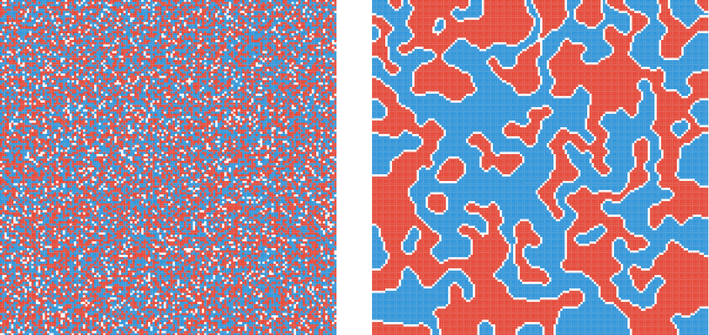

### Schelling's Model of Segregation Simulation

  

This is a simulation of [Schelling's Model of Segregation](https://www.stat.berkeley.edu/~aldous/157/Papers/Schelling_Seg_Models.pdf).

- There are two types of "agents", Red and Blue, representing two groups of people with some characteristic.
- Agents reside in cells in the grid.
- Agents want to move to a place where they have $t$% of neighbors (above, left, right, below, or diagonal) of their own kind.
  - If they have $t$% of neighbors of there own kind, they are _satisfied_ and will not move.
  - If they have fewer than $t$% of neighbors of their own kind, they are unsatisfied and will move to a random empty cell, that will make them satisfied.
  - If there are no empty cells that will make them satisfied, they will move to a random empty cell.
- The simulation continues until all agents are satisfied.
- The result is a pattern of segregation, where agents of the same kind cluster together.

#### Reducing Noise

To try to fix the problem of "floating" agents, where major clusters form, but agents don't join (because $t$ may not be met), the simulation uses a fallback:

- First, agents look for a spot where they will have $\geq t$% of neighbors.
- If that doesn't exist, they move to an empty spot with the highest number of neighbors of the same type, instead of floating around randomly.
- Otherwise, they move to a random empty spot.

---

Run the simulation in the browser [here](https://k0src.github.io/Schellings-Model-Simulation/), or clone this repository and run the Rust version (the JS version will crash if the grid is too large, but the Rust version can handle larger grids):

1. Download [Rust](https://rust-lang.org/tools/install/)
2. Run `cargo run --release` in the `rust` folder (make sure you include the `--release` flag, so Rust will optimize the program).
